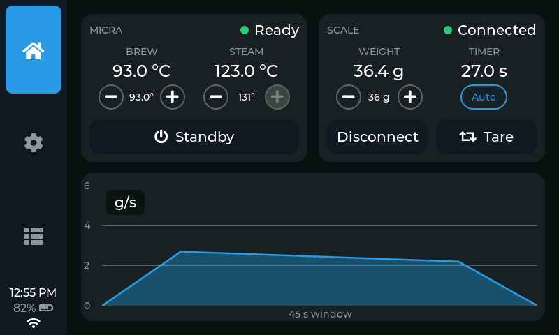
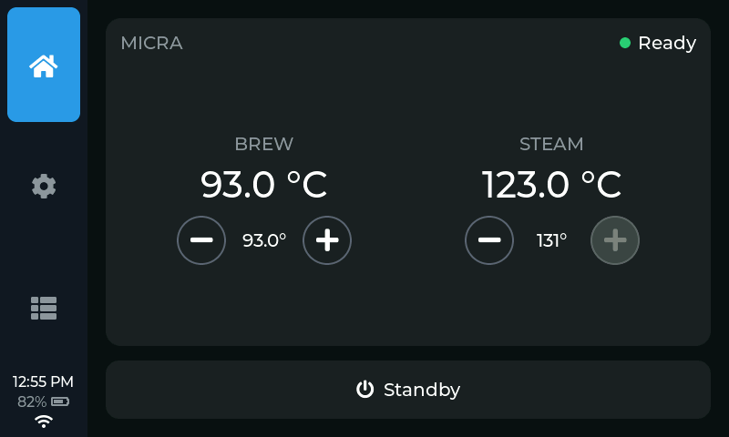
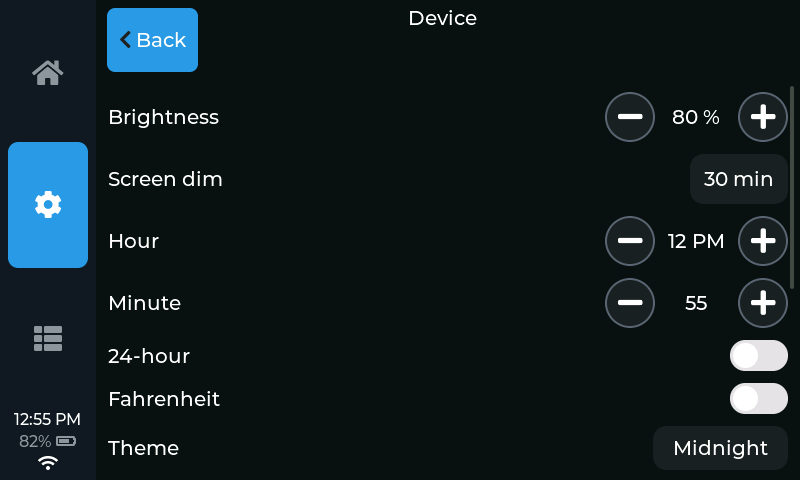
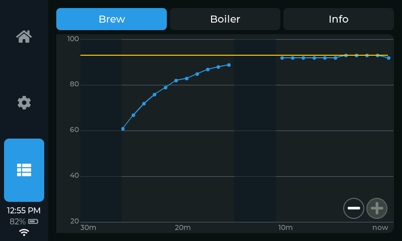

# Apollo 2

Firmware project that turns a small ESP32‑S3 touchscreen into a local
controller for a **La Marzocco Micra** espresso machine — over Bluetooth, with
no cloud dependency for day‑to‑day use.

Set your brew temperature, flip the steam boiler, put the machine on standby,
watch the boiler come up to temperature, and (with a supported Bluetooth scale)
run a live shot timer and flow graph — all from a dedicated little screen next
to the machine instead of a phone app.



> The focus is on local control via bluetooth. Currently internet is only used for optional NTP.

---

## Features

- **Micra control over Bluetooth (BLE)** — brew temperature set‑point, steam
  boiler level + on/off, power / standby, and live status (connecting, ready,
  disconnected) with the real brew and steam temperatures.
- **Bluetooth scale integration** — pair a supported scale (Bookoo Themis) for a
  live weight readout, an automatic shot timer, a scrolling flow‑rate graph
  (g/s or g), and tare from the screen.
- **Automatic time** — optionally join your home Wi‑Fi and the clock keeps itself
  correct over NTP, with a timezone picker that handles daylight saving. Time is
  saved to the on‑board RTC (where present) so it survives a power‑off.
- **Phone‑based setup, no app** — pairing and Wi‑Fi credentials are entered
  through a tiny web page the device serves from its own Wi‑Fi access point; you
  just join `Micra-Setup` and open it in a browser.
- **Made to live on the counter** — themes, °C/°F, 12/24‑hour clock, adjustable
  brightness, and a temperature‑history view. Layouts scale from a 2" pocket
  remote to a 7" panel.

Everything is designed to keep working if the machine, the scale, or Wi‑Fi is
absent — the UI just shows the relevant part as offline.

### Screenshots

<p align="center">
  
  
</p>
<p align="center">
  
</p>

<!-- Screenshots live in docs/img/ (tracked). They are curated copies of the
     simulator's output (renders/, git-ignored). When the UI changes, regenerate
     with `make sim` and refresh the relevant docs/img/*.png before/with any
     README update. -->

---

## Supported hardware

The firmware targets Waveshare ESP32 touch boards. One board is selected at
build time.

| Board | Display | Notes |
|-------|---------|-------|
| **ESP32‑S3‑Touch‑LCD‑2** | 2.0" 240×320, ST7789 (SPI) | A portable, battery‑friendly remote. |
| **ESP32‑S3‑Touch‑LCD‑4.3B** | 4.3" 800×480, RGB parallel | Larger counter‑top panel, primary dev target. Has a PCF85063 RTC. |
| **ESP32‑S3‑Touch‑LCD‑4.3C** | 4.3" 800×480, RGB parallel | 4.3B variant with a dimmable (PWM) backlight and battery monitoring. Has a PCF85063 RTC. |
| **ESP32‑S3‑Touch‑LCD‑7B** | 7" 1024×600, RGB parallel | Largest panel. |
| **ESP32‑P4‑WIFI6‑Touch‑LCD‑4.3** | 4.3" 800×480, MIPI‑DSI (ST7701) | ESP32‑P4 (32 MB flash / 32 MB PSRAM); WiFi 6 + BLE via on‑board ESP32‑C6. Bring‑up in progress. |

The S3 boards use the ESP32‑S3R8 (16 MB flash, 8 MB octal PSRAM). A supported
scale (Bookoo Themis Mini) is optional. Future support for Acaia Umbra coming.

---

## Getting started

### 1. Flash the firmware

Requires [PlatformIO](https://platformio.org/) (`pio`) and a USB cable.

```sh
make flash            # print selection of flash options
make flash-4-3b       # or target a specific board: 2inch | 7b | 4-3b | 4-3c | p4
make monitor          # open the serial console (115200 baud)
```

### 2. Pair the machine

**Settings → Micra → Bluetooth → Scan**, then pick your machine.

- **If it has never been paired to the La Marzocco app**, the machine still has
  its factory default token and the device reads it over Bluetooth automatically
  — you're connected, nothing to type.
- **If it's already paired to the LM app**, that default token has been rotated,
  so the auto‑read can't get it and you'll be prompted to enter the current one —
  see step 3.

### 3. Enter a token manually (only if step 2 didn't auto‑connect)

Tap **WiFi** on the prompt (or **Settings → Micra → Set up**) to start the
device's own Wi‑Fi access point, **`Micra-Setup`**. Join it from your phone, open
**http://192.168.4.1**, paste your token, and Save — the device connects and the
access point closes on its own.

Where to get the token:

- **Machine already paired to the LM app** → download **lmtoken** for your OS from
  the [Releases](../../releases) page, unzip, and run it. It asks for your La
  Marzocco account email + password and prints the current token. This is the only
  step that uses the internet, and it runs on your computer.
- **Machine never paired to the LM app** → its default token is also printed as a
  **QR code inside the machine**, if you'd rather scan and paste it than let
  step 2 read it automatically.

> Prefer to build `lmtoken` from source (Go), or script it? See
> [`tools/lmtoken/README.md`](tools/lmtoken/README.md).

### 4. (Optional) Wi‑Fi + automatic time

On the same setup page you can enter your home Wi‑Fi name and password. The
device then joins your network, gets an IP, and syncs the clock over NTP. Pick
your city under **Settings → Device → WiFi → Timezone**. Auto‑sync can be turned
off there too (**Auto time (NTP)**).

Because the setup page is always reachable from **Set up WiFi**, you can never be
locked out if your network changes.

---

## Using it

- **Home** shows the machine (and scale, if paired). The large action button is
  Standby / Turn On when connected, and becomes a **Connect** button when the
  machine is disconnected.
- **Settings** groups everything under Micra, Scale, and Device (brightness,
  clock, units, theme, Wi‑Fi).
- **Stats** shows brew/boiler temperature history and device info.

---

## Developer documentation

### Architecture

The code is layered so the same UI runs on a real board and on a laptop:

```
include/core/        Pure interfaces (ports) + domain types. No LVGL, Arduino,
                     BLE, or SDL — just C++ and structs. e.g. IMachine, IScale,
                     IClock, INetwork, IProvisioner, IBrewController, and the
                     BLE central port (ble::ICentral).

src/core/            Portable protocol logic: the La Marzocco Micra link and
                     the Bookoo scale driver, written only against ble::ICentral
                     — so a new platform (Linux/BlueZ, Pico/btstack) reuses the
                     Bluetooth protocol code unchanged and implements only the
                     transport.

src/ui/              The LVGL user interface. Depends ONLY on core/ interfaces,
                     never on a concrete platform. Portable.

src/platform_esp32/  Device implementations of the core ports: the NimBLE GATT
                     transport, NVS config, display/touch drivers, Wi-Fi
                     station + NTP, the setup-portal web server.

src/platform_host/   "Fake" implementations that feed canned data, so the UI can
                     be built and rendered on a host with no hardware.

src/device/main.cpp  Device entry: wires the real implementations to ui::App.
src/sim/main.cpp     Simulator entry: wires the fakes, renders frames to PNG.
```

The UI is written against the `core::` ports and is injected with concrete
implementations at startup (`App::build(...)`). Swapping the real BLE machine for
a `FakeMachine` is all that separates a board build from a laptop render — the UI
code is byte‑for‑byte identical.

### The simulator

No hardware needed. Builds a native executable that renders each screen/layout
to `renders/*.png`:

```sh
make sim              # build + run, writes renders/*.png
```

This is the fastest way to iterate on UI: change code, `make sim`, look at the
PNGs. Every supported screen size and several states are rendered.

The `renders/` folder is git‑ignored build output; the README screenshots in
`docs/img/` are curated copies. **When the UI changes, run `make sim` and refresh
the affected `docs/img/*.png` as part of the same change** so the README stays
accurate.

### Building directly

```sh
pio run -e esp32-s3-micra        # 2-inch firmware (default)
pio run -e esp32-s3-micra-4-3b   # 4.3" 800x480 (S3, RGB panel)
pio run -e esp32-s3-micra-4-3c   # 4.3" 800x480 (S3, RGB panel, dimmable + battery)
pio run -e esp32-s3-micra-7b     # 7"  1024x600
pio run -e esp32-p4-micra-43     # 4.3" 800x480 (P4, MIPI-DSI, WiFi6/BLE via C6)
pio run -e sim                   # native simulator
```

Build environments and per‑board flags live in
[`platformio.ini`](platformio.ini); the pin/panel definitions for each board are
in [`include/platform_esp32/board_config.h`](include/platform_esp32/board_config.h).

### Adding a board

Add an `#elif defined(BOARD_...)` block in `board_config.h` with the same
constant names the drivers read (pins, panel size, feature macros), then add a
matching `[env:...]` in `platformio.ini` with the `-DBOARD_...` flag. Driver code
never hardcodes a pin — it reads `board::` constants — so a new board is mostly a
config block.

### Repository layout

```
include/core/          Domain interfaces + types
src/core/              Portable protocol implementations (Micra BLE, scales)
include/platform_esp32/ Device driver headers + board_config.h
include/platform_host/  Host fakes
include/ui/             UI headers (widgets, screen profiles, timezones)
include/vendor/         Vendored third-party headers (stb_image_write)
src/                    Implementations (see Architecture above)
tools/                  sim.sh, flash.sh, lmtoken (Go), PlatformIO helper scripts
renders/                Simulator output (PNG)
```

---

## Credits & third‑party

This project stands on the work of others. Grateful thanks to:

- **[pylamarzocco](https://github.com/zweckj/pylamarzocco)** by Josef Zweck
  (MIT) — the reference for La Marzocco's Bluetooth protocol (GATT
  characteristic UUIDs, the JSON command/state payloads, machine name prefix) and
  the cloud auth flow that `tools/lmtoken` re‑implements in Go.
- **[goscale](https://github.com/mlsorensen/goscale)** (Apache‑2.0) — the model
  for the scale interface and the Bookoo Themis notification decode.
- **[apollo](https://github.com/mlsorensen/apollo)** — brew‑by‑weight /
  paddle‑stop approach that inspires the (in‑progress) brew controller.
- **Waveshare** — board bring‑up details and register maps for the CH422G IO
  expander, GT911 / CST816 touch controllers, and the RGB panel timings, from
  their published ESP32‑S3 demos.
- **[stb_image_write](https://github.com/nothings/stb)** by Sean Barrett (public
  domain / MIT) — vendored in `include/vendor/` for PNG output in the simulator;
  its license is retained in the file.

Library dependencies (fetched by PlatformIO): **LVGL** (MIT), **NimBLE‑Arduino**
(Apache‑2.0), **Arduino‑ESP32** (LGPL‑2.1 / Apache‑2.0), **GFX Library for
Arduino** (BSD‑style), and **ArduinoJson** (MIT). Each retains its own license.

---

## License

[MIT](LICENSE) © 2026 Marcus.

Not affiliated with or endorsed by La Marzocco. "La Marzocco" and "Micra" are
trademarks of their respective owner; used here only to describe compatibility.
