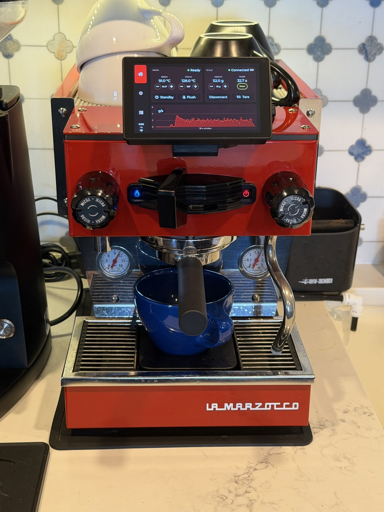
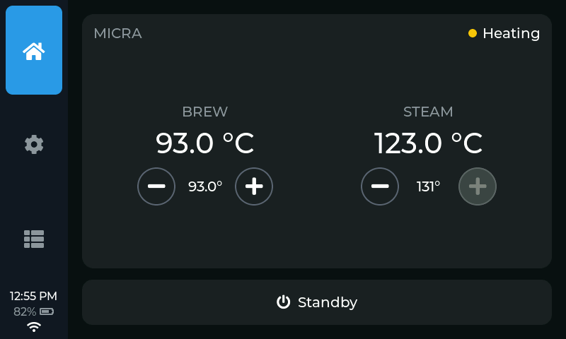
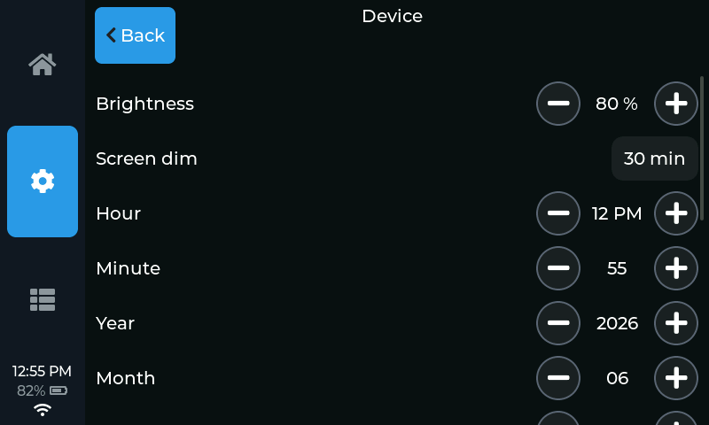
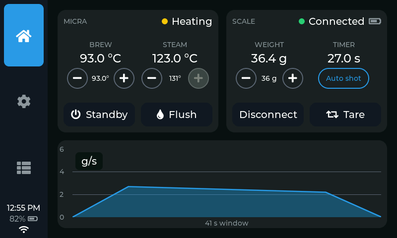
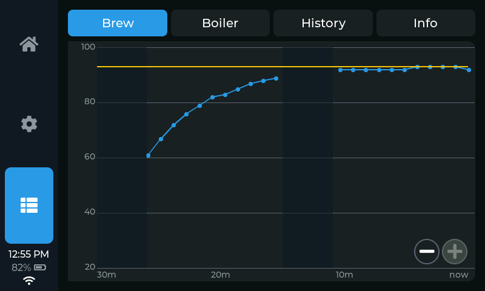

# Apollo 2

Firmware project that turns a small ESP32‑S3 touchscreen into a local
controller for a **La Marzocco Micra** espresso machine — over Bluetooth, with
no cloud dependency for day‑to‑day use.

Set your brew temperature, flip the steam boiler, put the machine on standby,
watch the boiler come up to temperature, and (with a supported Bluetooth scale)
run a live shot timer and flow graph — all from a dedicated little screen next
to the machine instead of a phone app.

<p align="center">
  
</p>

> The focus is on local control via bluetooth. Currently internet is only used for optional NTP.

---

## Features

- **Micra control over Bluetooth (BLE)** — brew temperature set‑point, steam
  boiler level + on/off, power / standby, and live status (connecting, ready,
  disconnected) with the real brew and steam temperatures. On boards with a
  speaker it **chimes once when the machine finishes warming up** — so you can
  start it and walk away — and stays quiet through the reheats that follow;
  the chime has its own volume setting (Off / 25 / 50 / 75 / 100 %).
- **Bluetooth scale integration** — pair a supported scale (**Bookoo Themis**,
  an **Acaia** — Umbra, Lunar, Prochef, or Pyxis — or a **Varia Aku**; Pyxis
  and Aku untested) for a live weight readout, an automatic shot timer, a live
  flow‑rate graph (g/s or g), and tare from the screen. Scales with on‑board
  settings (beep, auto‑off) expose them under Settings → Scale.
- **Brew by weight** — with a scale paired, pick a shot mode from the Home
  screen: **Auto shot** (boards wired into the paddle circuit stop the shot at
  your target weight, learning the drip overshoot per shot), **Shot detect**
  (start/stop inferred from the weight stream alone — works on every board, no
  wiring), or **Manual**. Finished shots freeze into a review graph, and wired
  boards can **auto‑flush** the group after you lift the cup, flush it on
  demand from Home, and run a **backflush cleaning** cycle (10 × 4 s on / 4 s
  off) from Settings.
- **Shot history on SD card** *(P4 boards and the S3 4.3C)* —
  every finished shot is recorded to a FAT‑formatted microSD card (any size —
  a shot is a few tens of KB, so a small old card holds decades): stats and
  the full weight/flow series as CSV under `/Apollo2/` — a take‑away database
  you can read on any computer. The Stats
  tab's **History** section shows totals, lifetime/30‑day accuracy, and a
  filterable shot list; tap a shot for its full‑screen card. With WiFi on,
  the device also serves a **web page** at its local IP — browse and download
  your shots from a phone or computer, themed to match the device.
- **Automatic time** — optionally join your home Wi‑Fi and the clock keeps itself
  correct over NTP, with a timezone picker that handles daylight saving. Time is
  saved to the on‑board RTC (where present) so it survives a power‑off.
- **Phone‑based setup, no app** — pairing and Wi‑Fi credentials are entered
  through a tiny web page the device serves from its own Wi‑Fi access point.
  Scan the QR code on the device's screen with your phone's camera and the
  setup page pops up on its own (or join `Micra-Setup` and open it in a
  browser).
- **Made to live on the counter** — themes, °C/°F, 12/24‑hour clock, adjustable
  brightness, and a temperature‑history view. Layouts scale from a 2" pocket
  remote to a 7" panel.

Everything is designed to keep working if the machine, the scale, or Wi‑Fi is
absent — the UI just shows the relevant part as offline.

### Screenshots

<p align="center">
  
  
</p>
<p align="center">
  
  
</p>

<!-- Screenshots live in docs/img/ (tracked). They are curated copies of the
     simulator's output (renders/, git-ignored). When the UI changes, regenerate
     with `make sim` and refresh the relevant docs/img/*.png before/with any
     README update. -->

---

## Supported hardware

The firmware targets Waveshare ESP32 touch boards. One board is selected at
build time.

### Which board?

Three boards come as **finished boxes** — no enclosure to print, nothing to
assemble. Flash one and set it on the counter: every board delivers the full
brew‑by‑weight experience with **zero wiring** (via Shot detect). The wiring
column below only matters if you *also* want **Auto shot** — the wired‑paddle
mode where the machine's own paddle starts the shot and the firmware cuts it
at target weight.

| Pick | Screen | Enclosure | Auto‑shot wiring *(optional)* | Performance |
|------|--------|-----------|-------------------------------|-------------|
| [ESP32‑S3‑Touch‑LCD‑4.3C **BOX**](https://www.waveshare.com/esp32-s3-touch-lcd-4.3c.htm?sku=33630) (SKU 33630) | 4.3" 800×480 | Finished box | **Built‑in opto** — three wires into screw terminals, nothing to build | Good |
| [ESP32‑P4‑WIFI6‑Touch‑LCD‑X **7" box**](https://www.waveshare.com/esp32-p4-wifi6-touch-lcd-7-8-10.1.htm) | 7" 1280×720 | Finished box | DIY cable with an external opto module | **Best** |
| [ESP32‑P4‑WIFI6‑Touch‑LCD‑X **8" box**](https://www.waveshare.com/esp32-p4-wifi6-touch-lcd-7-8-10.1.htm) | 8" 1280×800 | Finished box | DIY cable with an external opto module | **Best** |
| [ESP32‑P4‑WIFI6‑Touch‑LCD‑5](https://www.waveshare.com/esp32-p4-wifi6-touch-lcd-5.htm) (SKU 33762) | 5" 1280×720 | [3D‑printed shell](hardware/3d-prints/) | DIY cable with an external opto module | **Best** |

The ESP32‑P4 boards are the performance pick — much faster, with 32 MB flash +
32 MB PSRAM against the S3's 16/8 — so prefer them where the screen size fits.
The S3‑4.3C BOX remains the least‑hacking pick for Auto shot: it's the only
board with opto‑isolators built in, so even the paddle wiring needs no cable
assembly (the [wiring guide](docs/WIRING.md) covers both styles). The X‑series
boxes are new — the 7" is verified on hardware, the 8" not yet — and each
size takes its own firmware image.

### All supported boards

| Board | Display | Wired paddle (Auto shot) | Notes |
|-------|---------|--------------------------|-------|
| **ESP32‑S3‑Touch‑LCD‑2** | 2.0" 240×320, ST7789 (SPI) | — (Shot detect only) | A portable, battery‑friendly remote. |
| **ESP32‑S3‑Touch‑LCD‑4.3B** | 4.3" 800×480, RGB parallel | — (Shot detect only) | Counter‑top panel. Has a PCF85063 RTC. |
| **ESP32‑S3‑Touch‑LCD‑4.3C / 4.3C‑BOX** | 4.3" 800×480, RGB parallel | **Yes — built‑in.** Isolated DI/DO screw terminals (opto‑isolators on board) | **Recommended (easy path).** Dimmable backlight, battery monitoring, PCF85063 RTC, speaker. |
| **ESP32‑S3‑Touch‑LCD‑7B** | 7" 1024×600, RGB parallel | — (Shot detect only) | Largest panel. |
| **ESP32‑P4‑WIFI6‑Touch‑LCD‑4.3** | 4.3" 800×480, MIPI‑DSI (ST7701) | **Yes — external opto.** Native GPIOs + a PC817‑style opto module you wire | ESP32‑P4 (32 MB flash / 32 MB PSRAM); WiFi 6 + BLE via on‑board ESP32‑C6. |
| **ESP32‑P4‑WIFI6‑Touch‑LCD‑5** | 5" 1280×720, MIPI‑DSI (HX8394) | **Yes — external opto.** Same wiring as the P4 4.3 | **Recommended (performance path).** Same electronics as the P4 4.3 with a higher‑density panel (UI scaled 1.5×). No enclosure — a printable shell is [in the repo](hardware/3d-prints/). |
| **ESP32‑P4‑WIFI6‑Touch‑LCD‑X 7"** | 7" 1280×720, MIPI‑DSI (ILI9881C) | **Yes — external opto.** Same wiring as the P4 4.3/5 (GPIO 51/52 on the 40‑pin header) | **Recommended (easy + performance).** Finished box; same electronics as the other P4 boards. |
| **ESP32‑P4‑WIFI6‑Touch‑LCD‑X 8"** | 8" 1280×800, MIPI‑DSI (JD9365) | **Yes — external opto.** Same wiring as the P4 4.3/5 | **Recommended (easy + performance).** Finished box; same electronics as the other P4 boards. UI scaled 1.6×. Not yet verified on hardware. |

Boards without paddle wiring still get the full brew‑by‑weight experience via
**Shot detect** — only the automatic stop at target weight needs the wire.
Step‑by‑step wiring instructions (with photos of the Micra's paddle loom) are
in the **[wiring guide](docs/WIRING.md)**.

The S3 boards use the ESP32‑S3R8 (16 MB flash, 8 MB octal PSRAM). A supported
Bluetooth scale (Bookoo Themis, Acaia Umbra / Lunar / Prochef / Pyxis, or
Varia Aku — Pyxis and Aku untested) is optional but unlocks the shot timer,
flow graph, and brew‑by‑weight features.

### Power, battery, and RTC

The boards run from **USB‑C power** — that's the normal way to use them. An
optional battery can be installed (the boards have a battery connector), but
it only lasts a few hours, so treat it as a nice‑to‑have for moving the device
around, not a way to run it. An optional **RTC coin cell** (boards with an
RTC, e.g. the 4.3B/4.3C) keeps the clock through a power‑off — but it's only
needed if you *don't* configure Wi‑Fi + NTP, which sets the time automatically
on every boot.

### 3D‑printed stand, shells and mounts

Ready‑to‑print 3MF files live in [`hardware/3d-prints/`](hardware/3d-prints/):

| File | What it is |
|------|------------|
| [`apollo2-stand.3mf`](hardware/3d-prints/apollo2-stand.3mf) | Counter‑top **stand**. Mounts the S3‑4.3C‑BOX directly (it has the matching holes), and every shell below mounts to it the same way. |
| [`apollo2-magnet-mount.3mf`](hardware/3d-prints/apollo2-magnet-mount.3mf) | Optional **magnet mount** — attaches the device to the Micra's top corner instead of the counter. |
| [`apollo2-wiring-gasket.3mf`](hardware/3d-prints/apollo2-wiring-gasket.3mf) | Optional **wiring gasket** — spaces the Micra's cover so the wiring can run underneath it. |
| [`esp32-s3-4.3c-shell.3mf`](hardware/3d-prints/esp32-s3-4.3c-shell.3mf) | Shell for the bare **ESP32‑S3‑Touch‑LCD‑4.3C** (no‑enclosure variant). |
| [`esp32-p4-5-shell.3mf`](hardware/3d-prints/esp32-p4-5-shell.3mf) | Shell for the **ESP32‑P4‑WIFI6‑Touch‑LCD‑5**. |
| [`esp32-p4-4.3-shell.3mf`](hardware/3d-prints/esp32-p4-4.3-shell.3mf) | Shell for the **ESP32‑P4‑WIFI6‑Touch‑LCD‑4.3**. |
| [`esp32-s3-2-shell.3mf`](hardware/3d-prints/esp32-s3-2-shell.3mf) | Shell for the pocket **ESP32‑S3‑Touch‑LCD‑2**. |

This [short video](https://youtube.com/shorts/Ea0IaJ7hjvQ) shows how the
magnet mount and wiring gasket fit together on the machine.

Fasteners:

- **Shells**: 8 × **M2.5×0.45, 5 mm** screws each — 4 fasten the board into
  the shell, 4 fasten the shell cover.
- **Stand mount**: 2 × **M4‑0.7×8 mm** screws — same spec whether you're
  mounting the S3‑4.3C‑BOX or any of the printed shells.
- **Magnet mount**: 8 × **10 mm × 3 mm** neodymium disc magnets.

---

## Getting started

> [!IMPORTANT]
> **Before buying any hardware, confirm you can get your machine's Bluetooth
> token.** Apollo authenticates to the Micra with a token issued by the La
> Marzocco cloud. Grab it first with the **[LM Token](tools/lmtoken/)** app — sign
> in with your La Marzocco account and copy the token. If it comes back blank, the
> same tool can provision one over Bluetooth. Checking now avoids a nasty surprise
> after a board is already on your bench.

### 1. Flash the firmware

**No-toolchain option:** the [web flasher](https://mlsorensen.github.io/Apollo2/)
flashes any supported board straight from Chrome, Edge, or Firefox over USB —
pick your board, click Install. Upgrading this way keeps your paired machine,
Wi‑Fi and settings (unless you choose "Erase device"). Prebuilt images also live
on the [Releases](https://github.com/mlsorensen/Apollo2/releases) page — those
are full images, so flashing one with `esptool` *does* clear saved settings.

Building from source requires [PlatformIO](https://platformio.org/) (`pio`) and
a USB cable.

```sh
make flash            # print selection of flash options
make flash-s3-4-3b    # or target a board: s3-2 | s3-7b | s3-4-3b | s3-4-3c | p4-4-3 | p4-5 | p4-x-7 | p4-x-8
make monitor          # open the serial console (115200 baud)
```

### 2. Pair the machine

**Settings → Micra → Bluetooth → Scan**, then pick your machine. The device saves
it, then asks for the machine's **Bluetooth token** (step 3) — the token is issued
by the La Marzocco cloud and can't be read off the machine, so there's a short
one‑time step to fetch it.

### 3. Enter your token

Tap **Enter token** on the prompt (or **Settings → Micra → Set up**) to start the
device's own Wi‑Fi access point, **`Micra-Setup`**. Scan the QR code on the
device's screen with your phone's camera — it joins the access point and the
setup page pops up on its own. (Or join `Micra-Setup` manually and open
**http://192.168.4.1**.) Paste your token and Save — the device connects and the
access point closes on its own.

Where to get the token:

- Download the **LM Token** app for your OS from the [Releases](../../releases)
  page, unzip, and double-click it. Sign in with your La Marzocco account, pick
  your machine, and hit **Copy token**. This is the only step that uses the
  internet, and it runs on your computer. (Prefer a terminal? The `lmtoken` CLI
  is on the same page.)

> Prefer to build **LM Token** / `lmtoken` from source (Go), or script it? See
> [`tools/lmtoken/README.md`](tools/lmtoken/README.md).

### 4. (Optional) Wi‑Fi + automatic time

On the same setup page you can enter your home Wi‑Fi name and password. The
device then joins your network, gets an IP, and syncs the clock over NTP. Pick
your city under **Settings → Device → WiFi → Timezone**. Auto‑sync can be turned
off there too (**Auto time (NTP)**).

Because the setup page is always reachable from **Set up WiFi**, you can never be
locked out if your network changes.

---

## Using it

- **Home** shows the machine (and scale, if paired). The large action button is
  Standby / Turn On when connected, and becomes a **Connect** button when the
  machine is disconnected. With a scale, the pill under the shot timer cycles
  the shot mode — **Auto shot** (wired paddle boards) / **Shot detect** /
  **Manual** — and becomes **Reset** while a finished shot is up for review.
- **Settings** groups everything under Micra, Scale, and Device (brightness,
  clock, units, theme, Wi‑Fi).
- **Stats** shows brew/boiler temperature history, the shot **History** log
  (SD‑card boards), and device info.

Every screen and setting is described in the **[user manual](MANUAL.md)**.

---

## Developer documentation

### Architecture

The code is layered so the same UI runs on a real board and on a laptop:

```
include/core/        Pure interfaces (ports) + domain types. No LVGL, Arduino,
                     BLE, or SDL — just C++ and structs. e.g. IMachine, IScale,
                     IClock, INetwork, IProvisioner, IBrewController, IShotStore
                     (SD shot history), and the BLE central port (ble::ICentral).

src/core/            Portable protocol logic: the La Marzocco Micra link and
                     the Bookoo scale driver, written only against ble::ICentral
                     — so a new platform (Linux/BlueZ, Pico/btstack) reuses the
                     Bluetooth protocol code unchanged and implements only the
                     transport. Also the device-independent decisions: which
                     event makes which sound (sound.cpp), when a warm-up counts
                     as finished (ready_chime.h).

src/ui/              The LVGL user interface. Depends ONLY on core/ interfaces,
                     never on a concrete platform. Portable.

src/platform_esp32/  Device implementations of the core ports: the NimBLE GATT
                     transport, NVS config, display/touch drivers, Wi-Fi
                     station + NTP, the setup-portal web server.

src/platform_host/   "Fake" implementations that feed canned data, so the UI can
                     be built and rendered on a host with no hardware.

src/device/main.cpp  Device entry: wires the real implementations to ui::App.
src/sim/main.cpp     Simulator entry: wires the fakes, renders frames to PNG.
```

The UI is written against the `core::` ports and is injected with concrete
implementations at startup (`App::build(...)`). Swapping the real BLE machine for
a `FakeMachine` is all that separates a board build from a laptop render — the UI
code is byte‑for‑byte identical.

### The simulator

No hardware needed. Builds a native executable that renders each screen/layout
to `renders/*.png`:

```sh
make sim              # build + run, writes renders/*.png
```

This is the fastest way to iterate on UI: change code, `make sim`, look at the
PNGs. Every supported screen size and several states are rendered.

The `renders/` folder is git‑ignored build output; the README screenshots in
`docs/img/` are curated copies. **When the UI changes, run `make sim` and refresh
the affected `docs/img/*.png` as part of the same change** so the README stays
accurate.

### Prerequisites

**PlatformIO** (`pip install platformio`) builds everything, and **node** (any
recent LTS — `brew install node`) builds the shot-history web page the device
serves. That page is embedded in the firmware as a generated header,
`include/platform_esp32/webapp_dist.h`, which is **not committed**: every
`make build`/`make flash` target rebuilds it when anything under
[`tools/webapp/`](tools/webapp) changes, and the release workflow does the same,
so a board can never serve a page that has drifted from the source. `make sim`
needs no node — the simulator has no web server.

### Building directly

`pio run` does *not* generate the web-app header (that dependency lives in the
Makefile), so run `make webapp` first — or just use the `make` targets, which
handle it.

```sh
pio run -e esp32-s3-micra        # 2-inch firmware (default)
pio run -e esp32-s3-micra-4-3b   # 4.3" 800x480 (S3, RGB panel)
pio run -e esp32-s3-micra-4-3c   # 4.3" 800x480 (S3, RGB panel, dimmable + battery)
pio run -e esp32-s3-micra-7b     # 7"  1024x600
pio run -e esp32-p4-micra-43     # 4.3" 800x480 (P4, MIPI-DSI, WiFi6/BLE via C6)
pio run -e esp32-p4-micra-x-7    # X-series 7" box (P4 rev3+, 1280x720; also -x-8)
pio run -e sim                   # native simulator
```

Build environments and per‑board flags live in
[`platformio.ini`](platformio.ini); the pin/panel definitions for each board are
in [`include/platform_esp32/board_config.h`](include/platform_esp32/board_config.h).

### Adding a board

Add an `#elif defined(BOARD_...)` block in `board_config.h` with the same
constant names the drivers read (pins, panel size, feature macros), then add a
matching `[env:...]` in `platformio.ini` with the `-DBOARD_...` flag. Driver code
never hardcodes a pin — it reads `board::` constants — so a new board is mostly a
config block.

### Repository layout

```
include/core/          Domain interfaces + types
src/core/              Portable protocol implementations (Micra BLE, scales,
                       audio cues)
include/platform_esp32/ Device driver headers + board_config.h
include/platform_host/  Host fakes
include/ui/             UI headers (widgets, screen profiles, timezones)
include/vendor/         Vendored third-party headers (stb_image_write)
src/                    Implementations (see Architecture above)
hardware/3d-prints/     Printable stand, board shells + mounts (3MF)
tools/                  sim.sh, flash.sh, lmtoken (Go), PlatformIO helper scripts
renders/                Simulator output (PNG)
```

---

## Credits & third‑party

This project stands on the work of others. Grateful thanks to:

- **[pylamarzocco](https://github.com/zweckj/pylamarzocco)** by Josef Zweck
  (MIT) — the reference for La Marzocco's Bluetooth protocol (GATT
  characteristic UUIDs, the JSON command/state payloads, machine name prefix) and
  the cloud auth flow that `tools/lmtoken` re‑implements in Go.
- **[goscale](https://github.com/mlsorensen/goscale)** (Apache‑2.0) — the model
  for the scale interface and the Bookoo Themis notification decode.
- **[apollo](https://github.com/mlsorensen/apollo)** — brew‑by‑weight /
  paddle‑stop approach that inspires the (in‑progress) brew controller.
- **Waveshare** — board bring‑up details and register maps for the CH422G IO
  expander, GT911 / CST816 touch controllers, and the RGB panel timings, from
  their published ESP32‑S3 demos.
- **[stb_image_write](https://github.com/nothings/stb)** by Sean Barrett (public
  domain / MIT) — vendored in `include/vendor/` for PNG output in the simulator;
  its license is retained in the file.

Library dependencies (fetched by PlatformIO): **LVGL** (MIT), **NimBLE‑Arduino**
(Apache‑2.0), **Arduino‑ESP32** (LGPL‑2.1 / Apache‑2.0), **GFX Library for
Arduino** (BSD‑style), and **ArduinoJson** (MIT). Each retains its own license.

---

## License

[MIT](LICENSE) © 2026 Marcus.

Not affiliated with or endorsed by La Marzocco. "La Marzocco" and "Micra" are
trademarks of their respective owner; used here only to describe compatibility.
