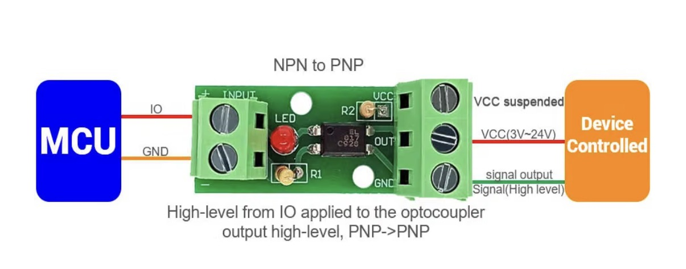

# Wiring the paddle (Auto shot)

This is the **optional** hardware step that unlocks **Auto shot** (the
firmware stops the shot at your target weight) and **auto‑flush**. Apollo sits
*in the middle* of the Micra's paddle circuit: the physical paddle switch now
feeds Apollo's sense input, and Apollo's isolated output stands in for the
paddle on the Micra's controller. Nothing else about the machine changes, and
**Shot detect** works fine without any of this.

The paddle circuit itself is low‑voltage (the Micra's controller puts ~5 V on
it), but you will have the machine open — **unplug the Micra first**.

> **Disclaimer:** this is a DIY modification. Done properly it is safe and
> fully reversible, but it is not endorsed by La Marzocco and you do it
> entirely at your own risk.

> **Note:** while this wiring is in place, the paddle works **only through
> Apollo** — with the controller off, unplugged, or missing, flipping the
> paddle does nothing. Because the tap is made with pluggable connectors,
> undoing it is easy: open the top and temporarily reconnect the paddle's
> original connectors to run the machine without Apollo.

## Parts

- A **3‑conductor cable** to run between Apollo and the machine — for example
  [this one](https://a.co/d/07cSW1AY), but any 3‑conductor cable works.
- **Bullet connectors** (or your favorite splice) for the in‑machine pigtail,
  so everything stays pluggable and reversible.
- **P4 boards only**: a single‑channel **PC817‑style opto‑isolator module**,
  e.g. [this one](https://a.co/d/03qHqcyM) — anything similar works. (The
  S3‑4.3C has isolators built in; no module needed.)

## Inside the Micra

Remove the Micra's top panel. Toward the back you'll find a **black loom**
carrying a thin **white** and a thin **black** wire, ending in connectors that
join the paddle switch:

Two connectors can be temporarily unplugged for easier access to the loom
(arrows):

Prepare your cable with bullet connectors, run it into the machine, unplug the
paddle connectors, and wire Apollo in the middle as described below. What
you're looking at:

- The **thin wires** go to the Micra's controller: **white = +5 V**,
  **black = ground**.
- The **thicker wires** go to the physical paddle switch. The paddle
  connectors have no polarity — either direction works.

## ESP32‑S3‑Touch‑LCD‑4.3C / 4.3C‑BOX (built‑in isolators)

The 4.3C's isolated DI/DO terminal block already contains the opto‑isolators,
so the 3‑conductor cable is the whole job:

| Board terminal | Connects to |
|----------------|-------------|
| **DO0** | Micra **white** (thin wire, controller +5 V) |
| **DI0** | one paddle‑switch wire |
| **GND** | Micra **black** (thin wire) **and** the other paddle‑switch wire (shared) |

Note: use the **GND** terminal for the paddle return, **not DI COM** — DI COM
is internally biased on this board, and the paddle must close DI0 to ground to
be sensed.

## ESP32‑P4 boards (external opto module)

On the P4‑WIFI6‑Touch‑LCD‑5 (and the 4.3), the paddle uses three native pins
on the corner of the header — **GND, GPIO 52, GPIO 51** — which fit a 3‑pin
screw terminal, plus the opto module for isolation:

Reading that diagram for our setup:

- **Drive (Apollo → Micra):** Apollo **GPIO 52** → opto module input **IO**,
  and Apollo **GND** → the module's input **GND**. On the output side leave
  **VCC unconnected** ("VCC suspended") so OUT/GND form an isolated dry
  contact: module **OUT** → Micra **white**, module output **GND** → Micra
  **black**. When Apollo raises GPIO 52, the contact closes — exactly like the
  paddle.
- **Sense (paddle → Apollo):** one paddle‑switch wire → Apollo **GPIO 51**,
  the other → Apollo **GND**. The physical paddle now touches only Apollo,
  never the Micra.

## Afterwards

Turn on **Settings → Micra → Settings → Wired paddle** so the firmware uses
the harness — the **Auto shot** mode then appears on the Home shot pill, and
**Auto flush** becomes available. See the [manual](../MANUAL.md) for what each
mode does.
