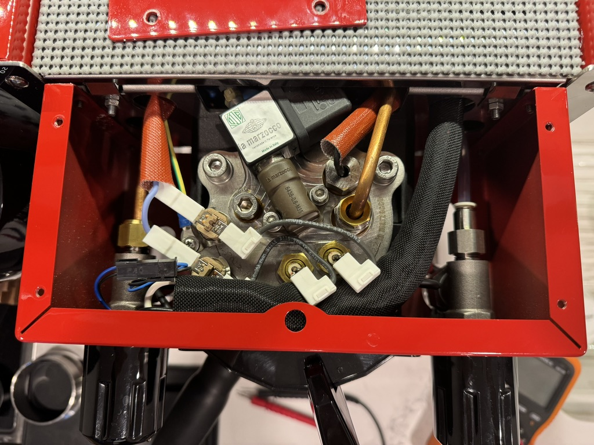
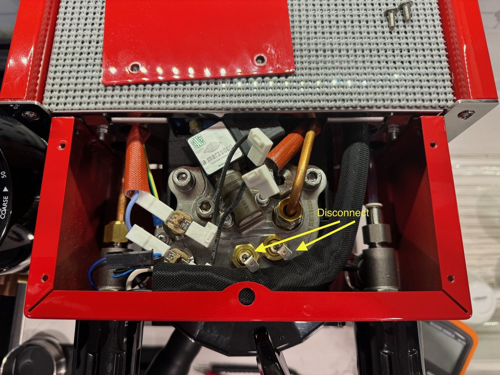
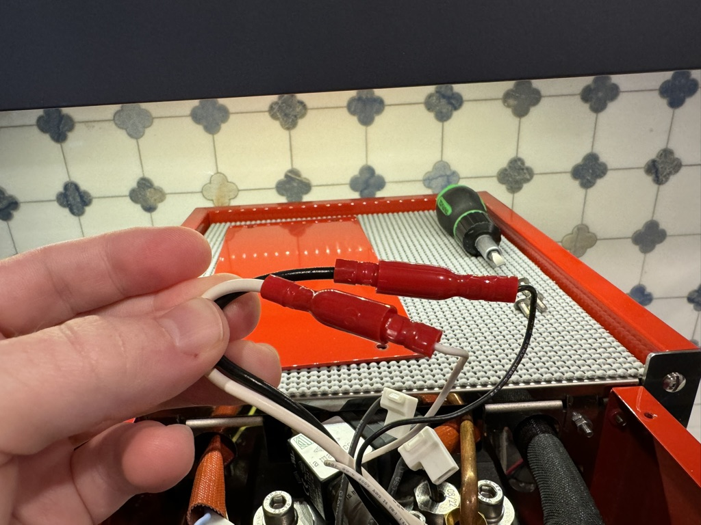
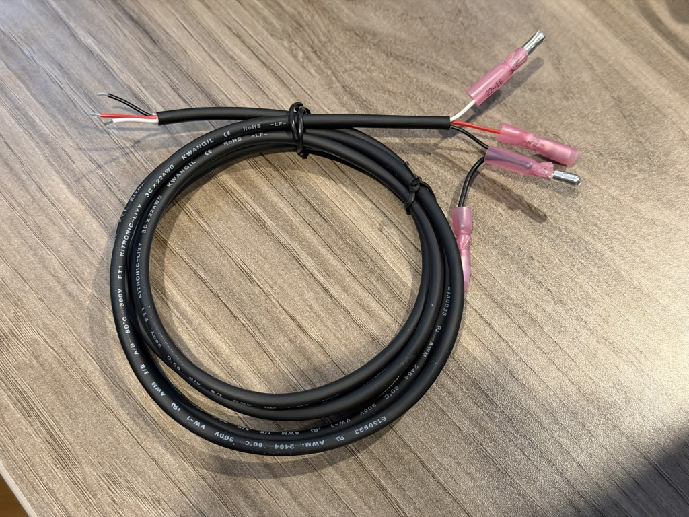
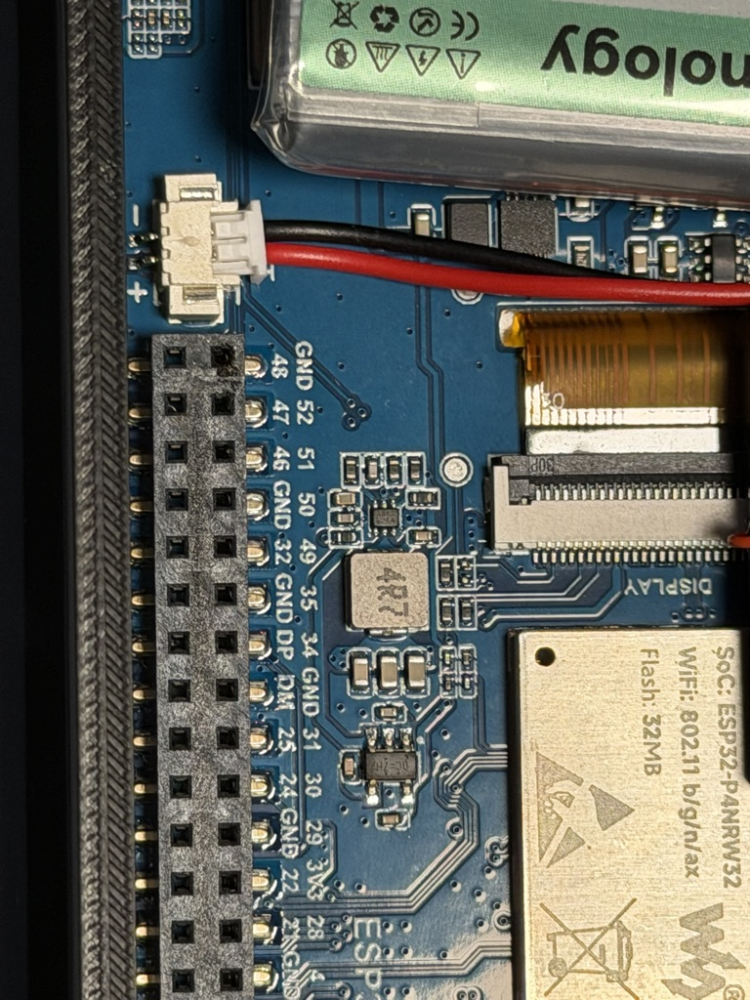
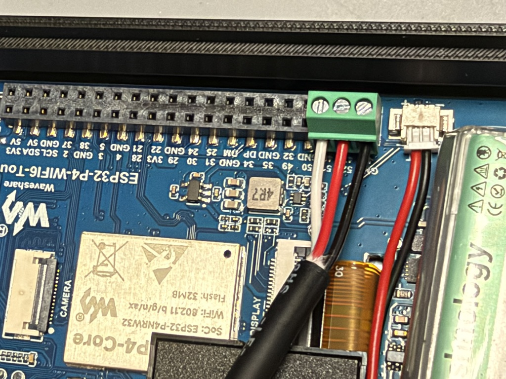
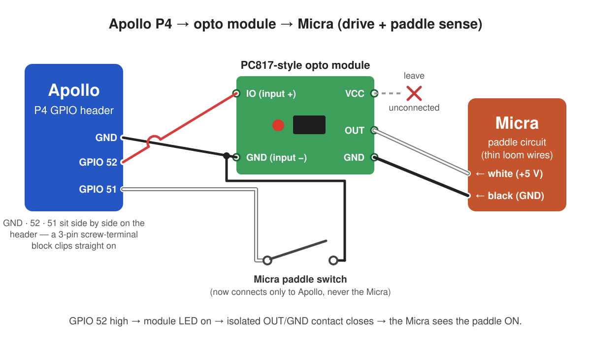
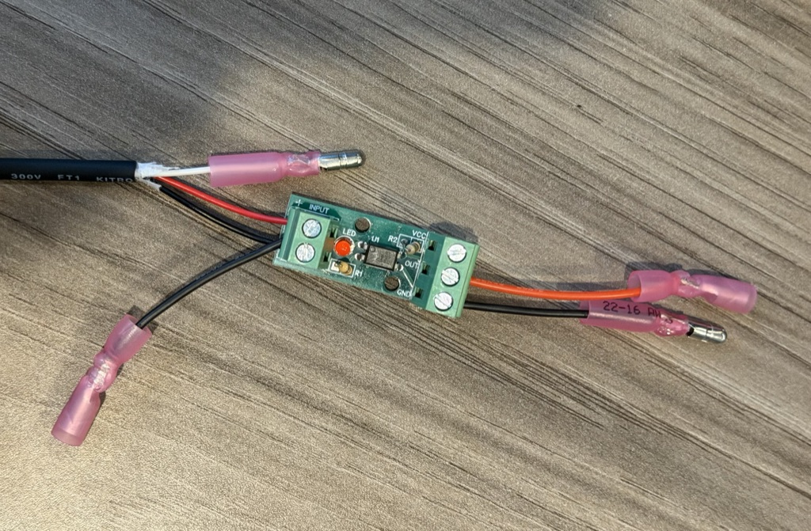
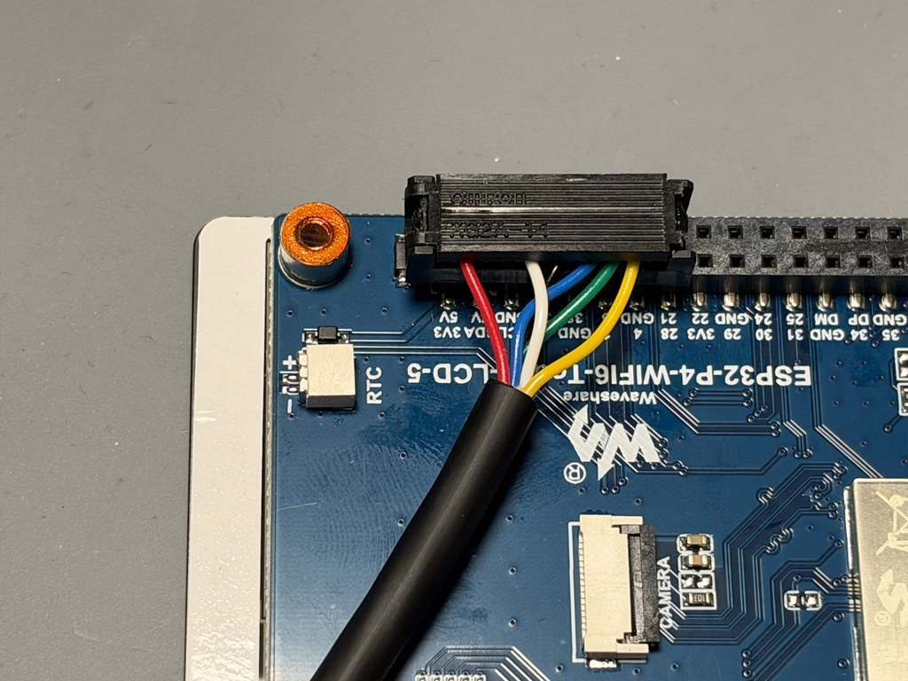
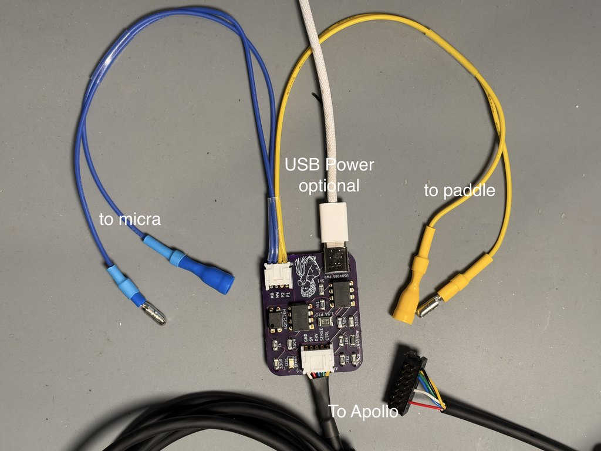

# Wiring the paddle (Auto shot)

This is the **optional** hardware step that unlocks **Auto shot** (the
firmware stops the shot at your target weight) and **auto‑flush**. Apollo sits
*in the middle* of the Micra's paddle circuit: the physical paddle switch now
feeds Apollo's sense input, and Apollo's isolated output stands in for the
paddle on the Micra's controller. Nothing else about the machine changes, and
**Shot detect** works fine without any of this.

The paddle circuit itself is low‑voltage (the Micra's controller puts ~5 V on
it), but you will have the machine open — **unplug the Micra first**.

> **Disclaimer:** this is a DIY modification. Done properly it is safe and
> fully reversible, but it is not endorsed by La Marzocco and you do it
> entirely at your own risk.

> **Note:** while this wiring is in place, the paddle works **only through
> Apollo** — with the controller off, unplugged, or missing, flipping the
> paddle does nothing. Because the tap is made with pluggable connectors,
> undoing it is easy: open the top and temporarily reconnect the paddle's
> original connectors to run the machine without Apollo.
> (The optional [Apollo Link](#apollo-link-optional-p4-boards) board below
> removes this caveat: it hands the paddle back to the machine whenever Apollo
> is off.)

## Parts

- A **3‑conductor cable** to run between Apollo and the machine — for example
  [this one](https://a.co/d/07cSW1AY), but any 3‑conductor cable works.
- **Bullet connectors** (or your favorite splice) for the in‑machine pigtail,
  so everything stays pluggable and reversible.
- **P4 boards only**: a single‑channel **PC817‑style opto‑isolator module**,
  e.g. [this one](https://a.co/d/03qHqcyM) — anything similar works. (The
  S3‑4.3C has isolators built in; no module needed.) A
  [2.54 mm screw‑terminal block](https://a.co/d/0eVdsD4h) that clips onto the
  P4's GPIO header makes the board‑side connection clean and solder‑free.

(P4 boards have an optional alternative to the module and the splice: the
[Apollo Link](#apollo-link-optional-p4-boards) board, further down.)

Although there are **four** connections at the machine end (Micra white,
Micra black, and the two paddle‑switch wires), one 3‑conductor cable is all
you need — **ground is shared**. It just means the ground conductor gets
**two connectors** at the machine end.

## Inside the Micra

Remove the Micra's top panel. Toward the front you'll find a **black loom**
carrying a thin **white** and a thin **black** wire, ending in connectors that
join the paddle switch:

Two connectors can be temporarily unplugged for easier access to the loom
(arrows):

Prepare your cable with bullet connectors, run it into the machine, unplug the
paddle connectors, and wire Apollo in the middle as described below. What
you're looking at:

- The **thin wires** go to the Micra's controller: **white = +5 V**,
  **black = ground**.
- The **thicker wires** go to the physical paddle switch. The paddle
  connectors have no polarity — either direction works.

## ESP32‑S3‑Touch‑LCD‑4.3C / 4.3C‑BOX (built‑in isolators)

The 4.3C's isolated DI/DO terminal block already contains the opto‑isolators,
so the 3‑conductor cable is the whole job:

| Board terminal | Connects to |
|----------------|-------------|
| **DO0** | Micra **white** (thin wire, controller +5 V) |
| **DI0** | one paddle‑switch wire |
| **GND** | Micra **black** (thin wire) **and** the other paddle‑switch wire (shared) |

Note: use the **GND** terminal for the paddle return, **not DI COM** — DI COM
is internally biased on this board, and the paddle must close DI0 to ground to
be sensed.

A finished 4.3C cable — bare wires for the screw terminals at the board end,
bullet connectors at the machine end (two on the shared ground conductor):

## ESP32‑P4 boards (external opto module)

On the P4‑WIFI6‑Touch‑LCD‑5 (and the 4.3), the paddle uses three native pins
that sit **side by side** on the corner of the GPIO header — **GND, GPIO 52,
GPIO 51**, in that order on the silkscreen — so a
[2.54 mm 3‑pin screw‑terminal block](https://a.co/d/0eVdsD4h) clips straight
onto them, no soldering. The X‑series boxes (7"/8") use the **same three
pins**: on their 40‑pin header one pin column runs GND, IO52, IO51 in a row
near the header's end (per the schematic — the photos below show the 5";
double‑check the silkscreen before clipping on):

The cable can run out through a hole in the 3D‑printed backplate. From there,
the opto module provides the isolation:

In detail:

- **Drive (Apollo → Micra):** Apollo **GPIO 52** → opto module input **IO**,
  and Apollo **GND** → the module's input **GND**. On the output side leave
  **VCC unconnected** ("VCC suspended") so OUT/GND form an isolated dry
  contact: module **OUT** → Micra **white**, module output **GND** → Micra
  **black**. When Apollo raises GPIO 52, the contact closes — exactly like the
  paddle.
- **Sense (paddle → Apollo):** one paddle‑switch wire → Apollo **GPIO 51**,
  the other → Apollo **GND**. The physical paddle now touches only Apollo,
  never the Micra. Suggested: a 1 kΩ resistor in line with this wire at the
  terminal block — it protects the input by limiting current from static or
  stray voltage on the wire, and has no effect on normal operation.
- **If a pin ever fails anyway**, both paddle pins can be remapped per unit
  (no custom build): move the wire to a free header GPIO and run
  `make padsense PIN=<n>` / `make paddrive PIN=<n>` with the board on USB —
  see the manual's "Paddle pin protection & per‑unit remapping" section.

**No‑solder way to add that resistor:** use a **4‑slot** screw‑terminal block
instead of the 3‑slot. Positions 1–3 land on GND / 52 / 51 as usual; position
4 hangs past the used pins — **bend or cut off its header pin** so it doesn't
insert into the board. Screw the **1 kΩ resistor** in as a jumper between
positions 3 and 4, then land the paddle‑sense wire in position **4** instead
of 3: the signal reaches GPIO 51 only through the resistor, and nothing was
soldered or spliced.

A finished P4 cable with the opto module spliced in near the machine end
(shown before wrapping the module in heat‑shrink — do wrap it, so nothing can
short out inside the machine). Of the cable's conductors, **red + black feed
the opto module's input** — that pair carries Apollo's drive and becomes the
Micra's paddle signal on the isolated side — while **white + the second
black** run to the physical paddle switch:

**Keep the opto module away from heat when installing it.** An opto‑isolator
loses transfer ratio as it warms, so one that heat‑soaks can stop registering
"paddle on" until it cools — a failure that looks exactly like a broken cable
and then fixes itself. Inside the machine is fine; sitting against the brew
head, a boiler, or any other heat‑producing surface is not. **Mount it low
and away from the brew head** — there is open space below the hot‑water pipe
and the steam wand that works well — and where clearance is tight, a piece of
neoprene sheet between the module and the nearest hot surface does the job.

## Apollo Link (optional, P4 boards)

**You do not need this.** The opto cable above is the simplest way to wire
the paddle and it is what most installs use. Apollo Link is a small
open‑hardware board that replaces the opto module and the DIY splice for
people who want two extra things:

- **The paddle keeps working without Apollo.** Solid‑state relays on the
  Link wire the paddle straight to the Micra in copper whenever Apollo is
  off, unplugged, rebooting or mid‑update, and hand it to Apollo only while
  Apollo is running. The "paddle works only through Apollo" caveat at the
  top of this page no longer applies.
- **One cable, no USB lead at the display.** A USB‑C power adapter plugs
  into the Link, and the same 5‑wire cable that carries the paddle also
  powers Apollo through its GPIO header.

Everything about it lives in the repo under
[`hardware/paddle-bridge`](../hardware/paddle-bridge): the KiCad schematic
and layout, a Mouser‑ready BOM (13 line items) and the gerbers to have the
board made. It is young — the first boards were built in October 2026 — so
expect rough edges.

**Parts:** the Link board, assembled; two JST PH housings (PHR‑5 for the
Apollo side, PHR‑4 for the machine side) with their crimp contacts; a
5‑conductor 24 AWG cable; any USB‑C 5 V adapter (1 A is plenty); and a
2 × 7 plug for the Apollo end of the cable — an IDC plug such as the Omron
XG2A‑1401 with 28 AWG wire lies flat against the board (a 2.54 mm crimp
housing works too, standing taller).

**Apollo end.** The Link uses a second set of pins at the **5 V end** of the
P4's 40‑pin header (the end nearest the RTC connector). The header's
silkscreen prints the GPIO *names*, so the five wires land on:

| wire | header label |
|---|---|
| 5V | **5V** (either of the two) |
| GND | **GND** (the one beside 5V, or the one beside 2) |
| DRV | **3** (GPIO 3) |
| SENSE | **5** (GPIO 5) |
| CTRL | **4** (GPIO 4) |

Those sit inside a 2 × 7 rectangle running from **4 … 3V3** on the outer row
and **GND … 5V** on the inner row, so a 14‑way IDC plug (Omron XG2A‑1401)
covers them in one go; the other positions in the block stay unwired, since
they carry the I2C bus (**SCL**, **SDA**), the console UART (**37**, **38**),
**2** and 3.3 V. The corner pins the opto cable uses (**GND / 52 / 51**) stay
free — the firmware drives both sets at once, so there is nothing to set,
and either cable works on any P4 unit.

**Link end.** J1 (marked *APOLLO*) takes the five wires in the order on its
silkscreen: GND, 5V, DRV, SENSE, CTRL. J2 (marked *Micra: paddle tap*)
goes to the machine: **P1** and **P2** to the two paddle‑switch wires,
**MW** and **MB** to the Micra's white and black. The USB‑C port marked
*PWR* is the 5 V supply. The green LED is lit while Apollo owns the paddle.

**Battery units:** power arriving through the header does not reach the
P4's charger, so a battery fitted to the board is **not charged** by the
Link; the charger only runs from the P4's own USB‑C. Battery‑less units
(the usual mount‑on‑Micra build) are unaffected.

**Heat:** the relays are rated to 85 °C. Mount the Link where you would
mount the opto module — low in the machine, away from the brew head.

**Bench‑test it like the opto cable** (next section): meter across MW and
MB, short P1 to P2 as the paddle. Plus one extra check that is the whole
point of the board: with Apollo **powered off** or unplugged, the short
must read **closed** on the meter, with the LED dark. Power Apollo up (LED
lit) and the same short reads **open** — the paddle now reaches Apollo
instead, and Apollo closes the Micra line itself when it runs a shot.

## Bench‑test before installing

The whole cable can be validated before it ever touches the machine. Connect
it to Apollo, power up, and turn on **Settings → Micra → Settings → Wired
paddle**. Apollo relays the paddle regardless of anything else, so:

1. **Touch the two paddle‑sense wires together** — to Apollo that's the
   paddle flipping ON. On a P4 build the opto module's **red LED lights**
   while they're touching.
2. **Meter the Micra side**: with a multimeter in continuity mode across the
   two machine‑side connectors (the ones destined for the Micra's white and
   black), you should read a **closed circuit** while the sense wires touch
   and **open** when you separate them.

That's the whole contract — paddle closed ⇒ Micra‑side contact closed — so if
both steps behave, the install will work.

## Closing up

Tuck the finished wiring down into the machine, **reconnect any connectors
you unplugged** for loom access, and put the top panel back on.

## Afterwards

With **Wired paddle** on (from the bench test above), the **Auto shot** mode
appears on the Home shot pill and **Auto flush** becomes available. See the
[manual](../MANUAL.md) for what each mode does.
